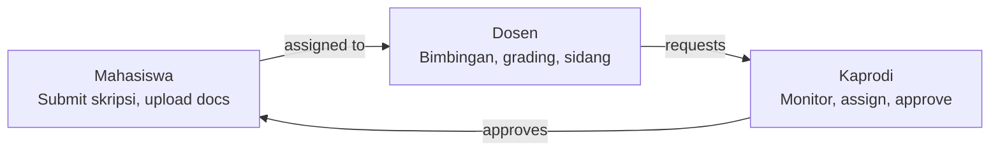
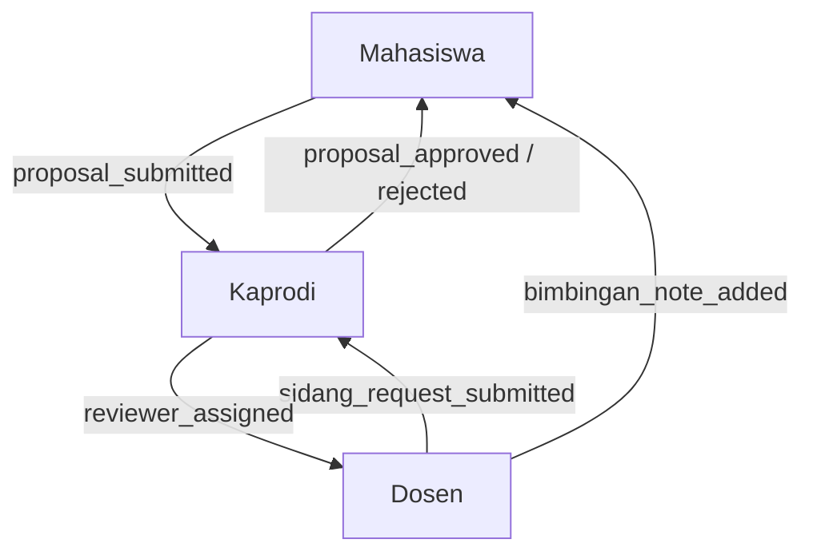
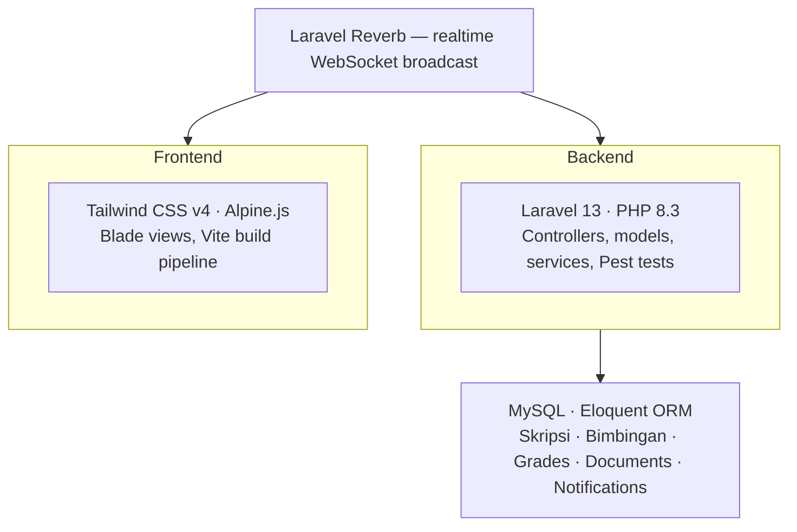

# TA Cloud

> A thesis management system for universities — managing skripsi submissions, bimbingan, sidang requests, document versioning, grading, and real-time notifications.


---

## Overview

TA Cloud is a role-based academic management platform built for universities to digitize and streamline the entire thesis (skripsi) lifecycle — from proposal submission through to final grading and archiving. It supports three user roles with scoped access, real-time notifications via WebSocket, and a modular Blade UI component system.

---

## System role flow



---

## Notification flow



---

## Tech stack



---

## Roles & permissions

| Role      | Scope                 | Key capabilities                                                              |
| --------- | --------------------- | ----------------------------------------------------------------------------- |
| Kaprodi   | Global                | CRUD master data, assign pembimbing/penguji, approve sidang, view grade recap |
| Dosen     | Assigned skripsi only | Bimbingan notes, penilaian input, sidang request submission                   |
| Mahasiswa | Own records only      | Skripsi CRUD, document upload, bimbingan response, non-skripsi record         |

---

## Active modules

### Kaprodi

- `Kaprodi\SkripsiController` → `kaprodi.skripsi.index`, `kaprodi.skripsi.show`, `kaprodi.skripsi.proposal`, `kaprodi.skripsi.bimbingan`, `kaprodi.skripsi.reviewers.*`, `kaprodi.skripsi.assign.*`, `kaprodi.skripsi.status.update`, `kaprodi.skripsi.sidang-schedule.update`, `kaprodi.skripsi.documents.download`, `kaprodi.skripsi.logbook`
- `Kaprodi\ProposalSubmissionController` → `kaprodi.skripsi.proposal.approve`, `kaprodi.skripsi.proposal.reject`, `kaprodi.proposal-submissions.index`
- `Kaprodi\FinalReviewController` → `kaprodi.skripsi.final-review.approve`, `kaprodi.final-reviews.index`
- `Kaprodi\SidangRequestController` → `kaprodi.skripsi.sidang-request.approve`, `kaprodi.skripsi.sidang-request.reject`, `kaprodi.sidang-requests.index`
- `Kaprodi\FormatPenilaianController` → `kaprodi.formats.*`, `kaprodi.formats.grades.show`, `kaprodi.formats.grades.unlock`
- `Kaprodi\DocumentTemplateController` → `kaprodi.document-templates.*`
- `Kaprodi\DosenController`, `Kaprodi\MahasiswaController`, `Kaprodi\TahunAkademikController`, `Kaprodi\PeriodeController`, `Kaprodi\ImportUserController`, `Kaprodi\NilaiController` → master data, import, recap
- Static/workspace views still present for `kaprodi.fase.index`, `kaprodi.keputusan.show`, `kaprodi.library.index`

### Dosen

- `Dosen\SkripsiViewController` → `dosen.skripsi.index`, `dosen.skripsi.show`, `dosen.skripsi.search`
- `Dosen\BimbinganController` → `dosen.bimbingan.store`, `dosen.bimbingan.update`, `dosen.bimbingan.destroy`
- `Dosen\PenilaianController` → `dosen.penilaian.index`, `dosen.penilaian.show`, `dosen.penilaian.store`, `dosen.penilaian.request-unlock`
- `Dosen\SidangRequestController` → `dosen.sidang-request.index`, `dosen.sidang-request.store`

### Mahasiswa

- `Mahasiswa\SkripsiController` → `mahasiswa.progres.index`, `mahasiswa.skripsi.*`
- `Mahasiswa\DocumentVersionController` → `mahasiswa.skripsi.proposal.upload`, `mahasiswa.skripsi.documents.store`, `mahasiswa.skripsi.proposal.file`, `mahasiswa.skripsi.documents.destroy`
- `Mahasiswa\BimbinganController` → `mahasiswa.skripsi.bimbingan.index`, `mahasiswa.skripsi.bimbingan.export.csv`, `mahasiswa.skripsi.bimbingan.export.pdf`, `mahasiswa.skripsi.bimbingan.update`, `mahasiswa.skripsi.bimbingan.revision.destroy`
- `Mahasiswa\NilaiController` → `mahasiswa.skripsi.nilai.index`
- `Mahasiswa\FinalSubmissionController` → `mahasiswa.final.index`, `mahasiswa.final.submit`
- `Mahasiswa\NonSkripsiController` → `mahasiswa.non-skripsi.*`

---

## Feature status

| Feature                                  | Status         |
| ---------------------------------------- | -------------- |
| Realtime notification system via Reverb  | ✅ Done        |
| Kaprodi, Dosen & Mahasiswa role layers   | ✅ Done        |
| Document versioning & bimbingan flow     | ✅ Done        |
| Sidang request & approval workflow       | ✅ Done        |
| Reusable Blade UI component library      | ✅ Done        |
| Role-based middleware & ownership checks | ✅ Done        |
| Grade lock/unlock workflow               | ✅ Done        |
| Final submission wiring (Mahasiswa)      | 🔄 In progress |
| Skripsi export & rekap                   | 📋 Planned     |
| Google OAuth login                       | 📋 Planned     |
| Super Admin & advanced RBAC              | 📋 Planned     |
| Program-specific workflows               | 📋 Planned     |

---

## Known gaps & priorities

- **Final Submission**: Active via `Mahasiswa\FinalSubmissionController` and `mahasiswa.final.*`, but still needs broader flow hardening and test coverage.
- **Reporting**: Building CSV/PDF export logic for Kaprodi-level oversight.
- **Workflow Automation**: Implementing the state-management logic for "Keputusan Akhir" and "Phase Board".
- **Library Integration**: Connecting finalized records to a public-facing repository view.
- **Advanced RBAC**: Moving from role-string levels to granular program-scoped permissions.

---

## Getting started

```bash
# Clone and install
git clone https://github.com/vinnoch/ta-cloud.git
cd ta-cloud
composer install
npm install

# Configure environment
cp .env.example .env
php artisan key:generate
php artisan migrate

# Run
npm run dev
php artisan reverb:start
```

---

## Project structure

```
app/
├── Http/Controllers/
│   ├── Kaprodi/            # Kaprodi-scoped controllers
│   ├── Dosen/              # Dosen-scoped controllers
│   └── Mahasiswa/          # Mahasiswa-scoped controllers
├── Models/                 # Eloquent models
├── Services/               # Business logic & notification services
└── Notifications/          # Laravel notification classes
resources/views/
├── kaprodi/                # Kaprodi views
├── dosen/                  # Dosen views
├── mahasiswa/              # Mahasiswa views
└── partials/               # Reusable Blade components
routes/web/                 # Role-scoped route files
tests/Feature/              # Pest feature tests per role
```

---

## License

MIT © Vinno Christmantara
