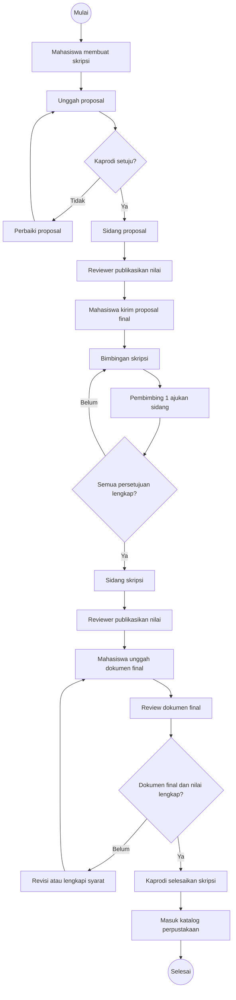
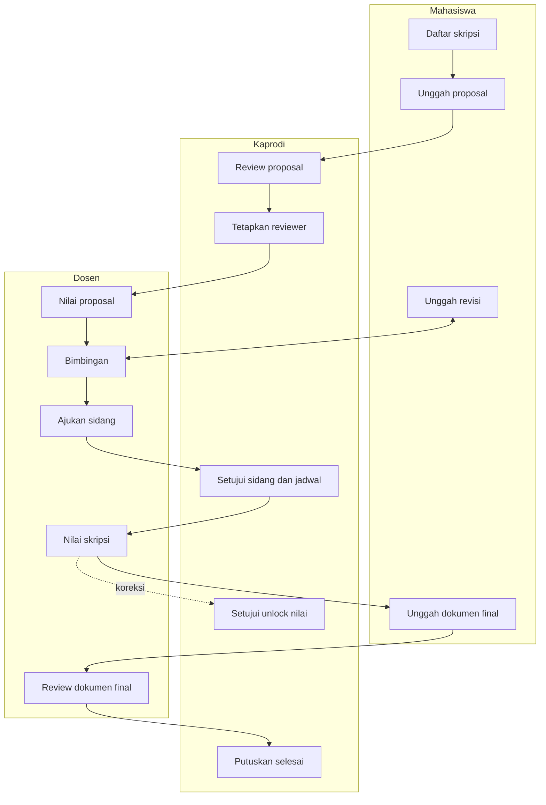
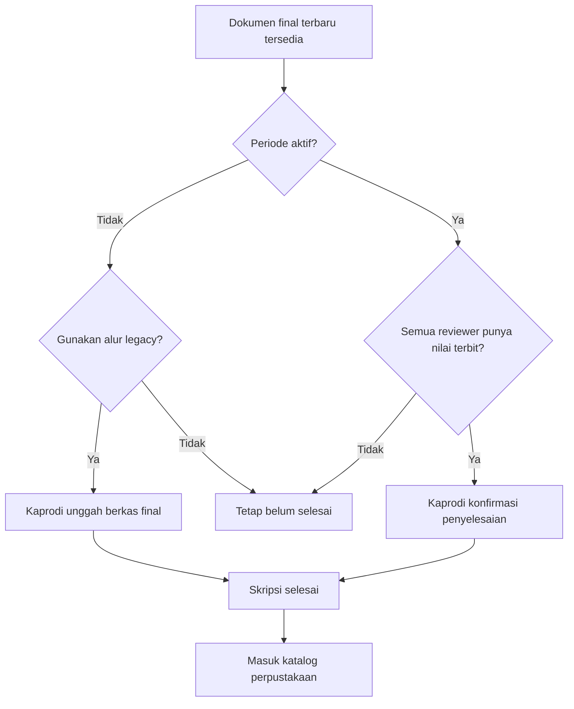

# TACLOUD — Current Product Flows and Roles

> **Purpose:** current-code evidence package for recompiling the TACLOUD launch-readiness report.  
> **Evidence date:** 20 July 2026 (Asia/Jakarta)  
> **Scope:** documentation only; findings describe the current shared workspace and do not change application behavior.

## Status Legend

| Status | Meaning |
|---|---|
| **IMPLEMENTED** | A current route, controller/service behavior, model, and relevant test evidence exist. |
| **PARTIAL** | The main capability exists, but an expected action, guard, integration, or production behavior is incomplete. |
| **BLOCKING GAP** | The missing behavior prevents a normal end-to-end business flow. |
| **NON-BLOCKING GAP** | The limitation does not stop the principal workflow, but should be tracked. |

# 1. Verification Method and Code-Review Graph

## 1.1 Graph Refresh

The code-review graph was fully rebuilt before this report was written.

| Metric | Result |
|---|---:|
| Workspace | `/Users/vinno/Herd/TACLOUD` |
| Rebuild mode | Full rebuild with full post-processing |
| Last updated | `2026-07-20T08:13:07` |
| Parsed files | 361 |
| Nodes | 905 |
| Edges | 1,601 after post-processing; 1,608 initially reported by the build |
| Classes | 65 |
| Functions | 479 |
| File nodes | 361 |
| `CALLS` edges | 324 |
| `CONTAINS` edges | 544 |
| `IMPORTS_FROM` edges | 731 |
| `REFERENCES` edges | 2 |
| Languages | PHP, JavaScript |
| Build errors | None (`[]`) |
| Structural risk score | Medium, 0.65 |

The graph found five JavaScript initialization flows. Laravel HTTP workflows were therefore verified through graph structure plus targeted route, controller, model, migration, configuration, and test inspection. The graph also reported 81 heuristic test gaps; this is not treated as 81 confirmed missing tests because graph-to-test association is structural rather than behavioral.

## 1.2 Focused Regression Evidence

The following focused suite was executed against authentication, authorization, cross-role behavior, final review, document access, library security, notifications, and route registration:

```text
php artisan test \
  tests/Feature/Auth \
  tests/Feature/Middleware/RoleMiddlewareTest.php \
  tests/Feature/Integration/CrossRoleTest.php \
  tests/Feature/Kaprodi/WorkflowControllerTest.php \
  tests/Feature/Dosen/FinalApprovalControllerTest.php \
  tests/Feature/Mahasiswa/FinalSubmissionControllerTest.php \
  tests/Feature/Mahasiswa/DocumentVersionControllerTest.php \
  tests/Feature/LibrarySecurityTest.php \
  tests/Feature/HttpSecurityHeadersTest.php \
  tests/Feature/NotificationControllerTest.php \
  tests/Feature/RouteRegistrationTest.php
```

**Result:** 79 tests passed, 284 assertions, 0 failures.

Primary test evidence:

- [AuthenticationTest.php](../../../../tests/Feature/Auth/AuthenticationTest.php)
- [GoogleSecurityTest.php](../../../../tests/Feature/Auth/GoogleSecurityTest.php)
- [RoleMiddlewareTest.php](../../../../tests/Feature/Middleware/RoleMiddlewareTest.php)
- [CrossRoleTest.php](../../../../tests/Feature/Integration/CrossRoleTest.php)
- [WorkflowControllerTest.php](../../../../tests/Feature/Kaprodi/WorkflowControllerTest.php)
- [FinalApprovalControllerTest.php](../../../../tests/Feature/Dosen/FinalApprovalControllerTest.php)
- [FinalSubmissionControllerTest.php](../../../../tests/Feature/Mahasiswa/FinalSubmissionControllerTest.php)
- [DocumentVersionControllerTest.php](../../../../tests/Feature/Mahasiswa/DocumentVersionControllerTest.php)
- [LibrarySecurityTest.php](../../../../tests/Feature/LibrarySecurityTest.php)
- [HttpSecurityHeadersTest.php](../../../../tests/Feature/HttpSecurityHeadersTest.php)
- [NotificationControllerTest.php](../../../../tests/Feature/NotificationControllerTest.php)
- [RouteRegistrationTest.php](../../../../tests/Feature/RouteRegistrationTest.php)

# 2. Product Purpose, Scope, Users, and Outputs

## 2.1 Product Purpose

TACLOUD is a Laravel-based academic workflow application for managing a student's thesis process from proposal registration through supervision, examinations, final-document review, completion, and library discovery.

The current product centralizes:

- thesis identity and academic-period data;
- proposal and final-document submissions;
- assignment of supervisors and examiners;
- guidance notes and revision history;
- examination requests, schedules, and grading;
- grade locking and controlled unlock requests;
- final completion decisions;
- document templates and required submissions;
- role-scoped notifications;
- management exports and monitoring;
- non-thesis student achievement records;
- a public thesis-library catalogue.

## 2.2 Technology Scope

| Layer | Current implementation |
|---|---|
| Backend | Laravel 13, PHP `^8.4` |
| Server-rendered UI | Blade |
| Authentication | Laravel session authentication, Laravel Socialite Google OAuth |
| Realtime notifications | Laravel Reverb and database notifications |
| Database | Relational database through Eloquent; production example targets MySQL |
| Queues, cache, sessions | Database-backed defaults in `.env.example` |
| Private files | Laravel local private disk |
| Testing | Pest feature tests |

Evidence: [composer.json](../../../../composer.json), [.env.example](../../../../.env.example), [filesystems.php](../../../../config/filesystems.php), [session.php](../../../../config/session.php).

## 2.3 Users

| User | Product responsibility |
|---|---|
| **Kaprodi** | Owns programme-level administration, master data, thesis workflow oversight, reviewer assignment, approvals, schedules, grade unlocks, completion, monitoring, and export. |
| **Dosen** | Acts as assigned supervisor or examiner; performs guidance, requests thesis examination when eligible, records grades, locks grades, and requests unlock when correction is required. |
| **Mahasiswa** | Owns one or more personal thesis records, uploads documents and revisions, follows guidance, submits final documents, and maintains personal non-thesis records. |
| **Public visitor** | Searches and reads catalogue metadata for completed theses. Public file access remains limited by the authenticated document routes. |

## 2.4 Principal Outputs

- Current thesis phase and status.
- Reviewer assignments and role responsibilities.
- Versioned proposal, revision, and final-document records.
- Guidance logs and exports.
- Examination requests and schedules.
- Weighted, published, and locked grades.
- Final completion status.
- Public completed-thesis catalogue entries.
- Kaprodi thesis CSV export.
- Student non-thesis records and supporting reports.

# 3. Current Architecture and Feature Inventory

## 3.1 Request and Authorization Structure

The application divides routes by role and applies exact role middleware after authentication:

- Mahasiswa: [routes/web/mahasiswa.php](../../../../routes/web/mahasiswa.php#L11)
- Dosen: [routes/web/dosen.php](../../../../routes/web/dosen.php#L9)
- Kaprodi: [routes/web/kaprodi.php](../../../../routes/web/kaprodi.php#L22)
- Shared authenticated and public routes: [routes/web/global.php](../../../../routes/web/global.php#L21)
- Authentication and Google OAuth: [routes/auth.php](../../../../routes/auth.php#L7)
- Exact role enforcement: [RoleMiddleware.php](../../../../app/Http/Middleware/RoleMiddleware.php#L14)

## 3.2 Complete Current Feature Inventory

| Area | Current capability | Status | Evidence |
|---|---|---|---|
| Local authentication | Login, logout, password reset, rate limiting, soft-deleted-user rejection | **IMPLEMENTED** | [AuthenticatedSessionController.php](../../../../app/Http/Controllers/Auth/AuthenticatedSessionController.php), [AuthenticationTest.php](../../../../tests/Feature/Auth/AuthenticationTest.php) |
| Google authentication | Institutional-domain OAuth, safe account linking, least-privilege creation | **IMPLEMENTED** | [GoogleController.php](../../../../app/Http/Controllers/Auth/GoogleController.php#L20), [GoogleSecurityTest.php](../../../../tests/Feature/Auth/GoogleSecurityTest.php) |
| Role separation | Exact Kaprodi, Dosen, and Mahasiswa middleware boundaries | **IMPLEMENTED** | [RoleMiddleware.php](../../../../app/Http/Middleware/RoleMiddleware.php#L14), [RoleMiddlewareTest.php](../../../../tests/Feature/Middleware/RoleMiddlewareTest.php) |
| Kaprodi master data | Dosen, Mahasiswa, academic-year, period, and grading-format CRUD; supported CSV imports | **IMPLEMENTED** | [routes/web/kaprodi.php](../../../../routes/web/kaprodi.php), `app/Http/Controllers/Kaprodi/` |
| Period management | Draft, active, closed, single-active-period enforcement, archival and deletion guards | **IMPLEMENTED** | [PeriodeController.php](../../../../app/Http/Controllers/Kaprodi/PeriodeController.php#L78) |
| Student period eligibility | UI period selection and server-side existence validation | **PARTIAL** — selected period is not required to be active | [SkripsiController.php](../../../../app/Http/Controllers/Mahasiswa/SkripsiController.php#L138) |
| Thesis CRUD | Mahasiswa creates, views, edits, and manages owned thesis records | **IMPLEMENTED** | [SkripsiController.php](../../../../app/Http/Controllers/Mahasiswa/SkripsiController.php), [Skripsi.php](../../../../app/Models/Skripsi.php#L28) |
| Reviewer assignment | Kaprodi assigns supervisors and examiners | **IMPLEMENTED** | [routes/web/kaprodi.php](../../../../routes/web/kaprodi.php), `app/Http/Controllers/Kaprodi/` |
| Proposal upload and review | Student uploads proposal; Kaprodi approves or rejects | **IMPLEMENTED** | [SkripsiController.php](../../../../app/Http/Controllers/Mahasiswa/SkripsiController.php#L404), [ProposalSubmissionController.php](../../../../app/Http/Controllers/Kaprodi/ProposalSubmissionController.php#L123) |
| Proposal examination | Assigned reviewers grade proposal examination | **IMPLEMENTED** | [PenilaianController.php](../../../../app/Http/Controllers/Dosen/PenilaianController.php#L186) |
| Final proposal submission | Student advances after required proposal grades are published | **IMPLEMENTED** | [FinalSubmissionController.php](../../../../app/Http/Controllers/Mahasiswa/FinalSubmissionController.php#L111) |
| Supervision | Assigned Dosen records guidance; student uploads revisions and sees own guidance | **IMPLEMENTED** | [BimbinganController.php](../../../../app/Http/Controllers/Mahasiswa/BimbinganController.php#L155), `app/Http/Controllers/Dosen/BimbinganController.php` |
| Thesis examination request | Primary supervisor requests examination; Kaprodi approves assigned-reviewer requests | **IMPLEMENTED** | [SidangRequestController.php](../../../../app/Http/Controllers/Dosen/SidangRequestController.php#L83), [SidangRequestController.php](../../../../app/Http/Controllers/Kaprodi/SidangRequestController.php#L112) |
| Examination scheduling | Kaprodi records proposal and thesis examination schedules | **IMPLEMENTED** | [routes/web/kaprodi.php](../../../../routes/web/kaprodi.php#L140), [SkripsiController.php](../../../../app/Http/Controllers/Kaprodi/SkripsiController.php) |
| Thesis grading | Assigned reviewers save draft or publish and lock weighted grades | **IMPLEMENTED** | [PenilaianController.php](../../../../app/Http/Controllers/Dosen/PenilaianController.php#L186) |
| Grade correction | Dosen requests unlock; Kaprodi approves unlock and returns grade to draft | **IMPLEMENTED** | [PenilaianController.php](../../../../app/Http/Controllers/Dosen/PenilaianController.php#L306), [FormatPenilaianController.php](../../../../app/Http/Controllers/Kaprodi/FormatPenilaianController.php#L374) |
| Final document submission | Student uploads the versioned final document after required grades are published | **IMPLEMENTED** | [FinalSubmissionController.php](../../../../app/Http/Controllers/Mahasiswa/FinalSubmissionController.php), [FinalSubmissionControllerTest.php](../../../../tests/Feature/Mahasiswa/FinalSubmissionControllerTest.php) |
| Normal completion | Kaprodi completes after the latest final file exists and every assigned reviewer has a published thesis-examination grade | **IMPLEMENTED** | [FinalReviewController.php](../../../../app/Http/Controllers/Kaprodi/FinalReviewController.php#L113), [WorkflowControllerTest.php](../../../../tests/Feature/Kaprodi/WorkflowControllerTest.php) |
| Legacy completion | Kaprodi uploads a final file and completes an inactive-period thesis without normal approval prerequisites | **IMPLEMENTED** | [FinalReviewController.php](../../../../app/Http/Controllers/Kaprodi/FinalReviewController.php#L167) |
| Manual phase update | Kaprodi can set any allowed thesis phase | **IMPLEMENTED administrative override** | [SkripsiController.php](../../../../app/Http/Controllers/Kaprodi/SkripsiController.php) |
| Document templates | Kaprodi creates, duplicates, publishes, period-scopes, and locks templates once used | **IMPLEMENTED** | [DocumentTemplateController.php](../../../../app/Http/Controllers/Kaprodi/DocumentTemplateController.php#L90) |
| Document access | Kaprodi, owner student, and assigned Dosen can preview/download authorized private files | **IMPLEMENTED for authenticated users** | [DocumentAccessController.php](../../../../app/Http/Controllers/DocumentAccessController.php#L32) |
| Public library catalogue | Public search and detail for completed theses with document evidence | **IMPLEMENTED** | [LibraryController.php](../../../../app/Http/Controllers/LibraryController.php#L14), [LibrarySecurityTest.php](../../../../tests/Feature/LibrarySecurityTest.php) |
| Public library file access | Controller contains a completed-final-document guest rule, but file routes require authentication | **PARTIAL** | [routes/web/global.php](../../../../routes/web/global.php#L21), [DocumentAccessController.php](../../../../app/Http/Controllers/DocumentAccessController.php#L32) |
| Kaprodi library management | Kaprodi page exists as static prototype; no publication/curation mutation exists | **PARTIAL / NON-BLOCKING GAP** | [routes/web/kaprodi.php](../../../../routes/web/kaprodi.php) |
| Notifications | Per-user database notifications, read/read-all, normalized links, Reverb broadcast | **IMPLEMENTED** | [NotificationService.php](../../../../app/Services/NotificationService.php#L36), [NotificationController.php](../../../../app/Http/Controllers/Notifications/NotificationController.php#L35) |
| Kaprodi export | Filtered thesis CSV export | **IMPLEMENTED** | [SkripsiController.php](../../../../app/Http/Controllers/Kaprodi/SkripsiController.php#L472) |
| Guidance export | Mahasiswa CSV/PDF and Kaprodi logbook CSV | **IMPLEMENTED** | [routes/web/mahasiswa.php](../../../../routes/web/mahasiswa.php), [routes/web/kaprodi.php](../../../../routes/web/kaprodi.php) |
| Non-thesis records | Student-owned CRUD, evidence upload/link and score; Kaprodi read-only monitoring | **IMPLEMENTED** | [NonSkripsiController.php](../../../../app/Http/Controllers/Mahasiswa/NonSkripsiController.php#L39), [NonSkripsiController.php](../../../../app/Http/Controllers/Kaprodi/NonSkripsiController.php#L15) |
| Security headers | `nosniff`, `SAMEORIGIN`, strict-origin referrer policy | **IMPLEMENTED** | [AddSecurityHeaders.php](../../../../app/Http/Middleware/AddSecurityHeaders.php#L11), [HttpSecurityHeadersTest.php](../../../../tests/Feature/HttpSecurityHeadersTest.php) |

# 4. Roles, Permissions, and Responsibilities

## 4.1 Role-Permission-Responsibility Matrix

| Capability | Kaprodi | Dosen | Mahasiswa |
|---|---|---|---|
| View programme-wide thesis data | Full | Assigned theses only | Own theses only |
| Manage Dosen and Mahasiswa master data | Create/read/update/delete and import | No | No |
| Manage academic years and periods | Full | Read indirectly where needed | Select period during thesis creation |
| Manage grading formats | Full | Use published format for assigned grading | Read resulting grades where exposed |
| Manage document templates | Full | Read/use in assigned workflow | View and submit required items |
| Create thesis | Administrative visibility/override | No | Own record |
| Edit thesis identity | Programme oversight | No | Own record while permitted |
| Review proposal | Approve/reject | No | Submit/revise |
| Assign reviewers | Full | No | No |
| Record guidance | Monitor | Assigned supervisor | View own notes and upload revisions |
| Request thesis examination | Monitor/approve | Primary supervisor only | No |
| Schedule examinations | Full | View assigned schedule | View own schedule |
| Grade examination | View/manage unlock | Assigned reviewer only | View own outcome |
| Publish and lock grade | No direct grading role | Assigned reviewer | No |
| Unlock grade | Approve unlock | Request unlock | No |
| Submit final document | Monitor | Review data only | Own thesis |
| Complete normal thesis | Yes, if all completion conditions pass | No | No |
| Complete legacy thesis | Yes, inactive period only | No | No |
| Export programme thesis data | CSV | No programme export | Own guidance CSV/PDF |
| Manage non-thesis records | Read-only monitoring | No dedicated capability | Own CRUD |
| Access public library | Yes | Yes | Yes |

## 4.2 Inheritance

Roles do not inherit from one another. Kaprodi has broader programme authority, but this is implemented through separate routes and controllers rather than role inheritance. `RoleMiddleware` checks an exact role value and returns HTTP 403 for mismatch.

Evidence: [RoleMiddleware.php](../../../../app/Http/Middleware/RoleMiddleware.php#L14), [RoleMiddlewareTest.php](../../../../tests/Feature/Middleware/RoleMiddlewareTest.php).

# 5. Authorization and Ownership Rules

## 5.1 Route Boundary

All role workspaces require an authenticated session and the matching role middleware. Cross-role route access is denied even if the user knows the URL.

Evidence: [routes/web/mahasiswa.php](../../../../routes/web/mahasiswa.php#L11), [routes/web/dosen.php](../../../../routes/web/dosen.php#L9), [routes/web/kaprodi.php](../../../../routes/web/kaprodi.php#L22), [CrossRoleTest.php](../../../../tests/Feature/Integration/CrossRoleTest.php).

## 5.2 Mahasiswa Ownership

Student mutations and private views verify that the thesis or non-thesis record belongs to the authenticated student's user ID. This is enforced in the thesis, document-version, guidance, final-submission, and non-thesis controllers rather than relying only on hidden UI controls.

Evidence:

- [SkripsiController.php](../../../../app/Http/Controllers/Mahasiswa/SkripsiController.php)
- [DocumentVersionController.php](../../../../app/Http/Controllers/Mahasiswa/DocumentVersionController.php#L27)
- [BimbinganController.php](../../../../app/Http/Controllers/Mahasiswa/BimbinganController.php#L155)
- [FinalSubmissionController.php](../../../../app/Http/Controllers/Mahasiswa/FinalSubmissionController.php#L111)
- [NonSkripsiController.php](../../../../app/Http/Controllers/Mahasiswa/NonSkripsiController.php#L88)

## 5.3 Dosen Assignment Boundary

Dosen access is limited to theses where the authenticated lecturer has a reviewer assignment. Guidance updates additionally verify that the note belongs to that reviewer. A thesis-examination request may be submitted only by the assigned `pembimbing_1` while the thesis is in `bimbingan_skripsi`.

Evidence: [SkripsiViewController.php](../../../../app/Http/Controllers/Dosen/SkripsiViewController.php#L233), [SidangRequestController.php](../../../../app/Http/Controllers/Dosen/SidangRequestController.php#L83), `app/Http/Controllers/Dosen/BimbinganController.php`.

## 5.4 Private Document Authorization

Private document access is permitted to:

1. Kaprodi;
2. the student who owns the thesis;
3. a Dosen assigned to the thesis.

The controller also contains an allowance for guest access to completed final documents, but the shared preview/download routes are currently inside authenticated middleware. Public catalogue visitors therefore cannot reach that controller rule without authentication.

Evidence: [DocumentAccessController.php](../../../../app/Http/Controllers/DocumentAccessController.php#L32), [routes/web/global.php](../../../../routes/web/global.php#L21).

# 6. Implemented Thesis Lifecycle

## 6.1 Persisted Phases

| Phase | Current meaning | Entry path |
|---|---|---|
| `proposal` | Thesis identity and proposal preparation/review | Student creates thesis; proposal rejection returns here |
| `sidang_proposal` | Proposal examination and grading | Kaprodi approves proposal |
| `bimbingan_skripsi` | Thesis supervision and revisions | Student submits final proposal after required proposal grades |
| `sidang_skripsi` | Thesis examination and grading | Kaprodi approves all required examination requests |
| `revisi_sidang_skripsi` | Post-examination revision/grading-compatible phase | Allowed by model/controllers and manual Kaprodi phase update; no dedicated automatic transition was found |
| `review_dokumen_final` | Final-document and completion review | Student submits final thesis after required grades |
| `skripsi_selesai` | Completed thesis | Normal Kaprodi completion or legacy completion |

Evidence: [Skripsi.php](../../../../app/Models/Skripsi.php#L28), [Skripsi.php](../../../../app/Models/Skripsi.php#L102).

## 6.2 Valid Current Transitions and Guards

| From | Trigger | To | Guard and owner | Status |
|---|---|---|---|---|
| New | Mahasiswa creates thesis | `proposal` | Authenticated Mahasiswa owns record | **IMPLEMENTED** |
| `proposal` | Mahasiswa uploads proposal PDF | `proposal` with pending submission | PDF, maximum 20 MB; submission/request created | **IMPLEMENTED** |
| `proposal` | Kaprodi approves proposal | `sidang_proposal` | Pending proposal submission | **IMPLEMENTED** |
| `proposal` | Kaprodi rejects proposal | `proposal` | Rejection note recorded | **IMPLEMENTED** |
| `sidang_proposal` | Assigned reviewers publish required grades; Mahasiswa submits final proposal | `bimbingan_skripsi` | Required assigned-role grade count satisfied | **IMPLEMENTED** |
| `bimbingan_skripsi` | `pembimbing_1` requests examination | Same phase pending approval | Assigned primary supervisor only | **IMPLEMENTED** |
| `bimbingan_skripsi` | Kaprodi approves all assigned supervisor requests | `sidang_skripsi` | All required assigned-request approvals exist | **IMPLEMENTED** |
| `sidang_skripsi` or `revisi_sidang_skripsi` | Required grades are published; Mahasiswa submits final thesis | `review_dokumen_final` | Latest final document stored | **IMPLEMENTED** |
| `review_dokumen_final` | Kaprodi completes normal flow | `skripsi_selesai` | Latest final document and published thesis grade for every assignment | **IMPLEMENTED** |
| Any applicable legacy record | Kaprodi completes inactive-period record | `skripsi_selesai` | Period inactive; final PDF/DOC/DOCX up to 20 MB | **IMPLEMENTED** |
| Any current phase | Kaprodi manual status update | Any allowed phase | Programme-level administrative override | **IMPLEMENTED, governance risk** |

Evidence:

- [SkripsiController.php](../../../../app/Http/Controllers/Mahasiswa/SkripsiController.php#L404)
- [ProposalSubmissionController.php](../../../../app/Http/Controllers/Kaprodi/ProposalSubmissionController.php#L123)
- [FinalSubmissionController.php](../../../../app/Http/Controllers/Mahasiswa/FinalSubmissionController.php#L111)
- [SidangRequestController.php](../../../../app/Http/Controllers/Dosen/SidangRequestController.php#L83)
- [SidangRequestController.php](../../../../app/Http/Controllers/Kaprodi/SidangRequestController.php#L224)
- [FinalSubmissionController.php](../../../../app/Http/Controllers/Mahasiswa/FinalSubmissionController.php#L339)
- [FinalReviewController.php](../../../../app/Http/Controllers/Kaprodi/FinalReviewController.php#L115)
- [FinalReviewController.php](../../../../app/Http/Controllers/Kaprodi/FinalReviewController.php#L167)

## 6.3 End-to-End Lifecycle Diagram



**Current-code qualification:** final-document approval records were removed as dead workflow state. Kaprodi completion now evaluates the submitted final document and published reviewer grades directly.

# 7. Role Handoffs

## 7.1 Handoff Table

| Handoff | Sender | Receiver | Data or decision | Current state |
|---|---|---|---|---|
| Proposal submission | Mahasiswa | Kaprodi | Proposal file and submission request | **IMPLEMENTED** |
| Proposal decision | Kaprodi | Mahasiswa | Approve/reject and note | **IMPLEMENTED** |
| Reviewer assignment | Kaprodi | Dosen | Thesis assignment and reviewer role | **IMPLEMENTED** |
| Proposal grading | Dosen | Mahasiswa/Kaprodi | Published locked grade | **IMPLEMENTED** |
| Revision upload | Mahasiswa | Assigned Dosen | New version and guidance context | **IMPLEMENTED** |
| Guidance note | Dosen | Mahasiswa | Supervision note/status | **IMPLEMENTED** |
| Examination request | Primary supervisor | Kaprodi | Readiness request | **IMPLEMENTED** |
| Examination approval/schedule | Kaprodi | Dosen and Mahasiswa | Approval and schedule | **IMPLEMENTED** |
| Thesis grading | Assigned Dosen | Kaprodi/Mahasiswa | Published locked grade | **IMPLEMENTED** |
| Grade-unlock request | Dosen | Kaprodi | Correction request | **IMPLEMENTED** |
| Grade unlock | Kaprodi | Dosen | Grade returned to draft | **IMPLEMENTED** |
| Final-document submission | Mahasiswa | Assigned reviewers/Kaprodi | Versioned final file | **IMPLEMENTED** |
| Completion | Kaprodi | Mahasiswa/public catalogue | Completed phase after final-file and grade guards | **IMPLEMENTED normal and legacy** |

## 7.2 Role-Handoff Diagram



`D5` is the currently missing application action. Approval records are generated, and Kaprodi's completion gate reads them, but no Dosen mutation route exists.

# 8. Business Rules

## 8.1 Institutional Google Authentication

**Status: IMPLEMENTED**

- Only an exact, case-normalized `@widyakarya.ac.id` suffix is accepted.
- Empty emails, foreign domains, suffix spoofing, and subdomains are rejected.
- Existing users are matched case-insensitively.
- A valid institutional account not already present is created with the least-privileged `mahasiswa` role.
- Existing role assignments are preserved.
- Soft-deleted users cannot authenticate.
- Existing Google identifiers are preserved; avatar and email-verification data can be updated.
- The session is regenerated after authentication.
- Intended redirects are restricted to safe same-host destinations.
- Google routes are guest-only.

Evidence: [GoogleController.php](../../../../app/Http/Controllers/Auth/GoogleController.php#L20), [services.php](../../../../config/services.php#L38), [.env.example](../../../../.env.example#L82), [GoogleSecurityTest.php](../../../../tests/Feature/Auth/GoogleSecurityTest.php).

## 8.2 Uploads, Documents, and Versioning

**Status: IMPLEMENTED, with public-download limitation**

| Document | Accepted input | Maximum | Rule |
|---|---|---:|---|
| Proposal | PDF | 20 MB | Proposal phase only |
| Guidance revision | PDF, DOC, DOCX | 2 MB | Owned thesis; versioned guidance context |
| Final thesis | PDF, DOC, DOCX | 20 MB | Eligible examination/revision phase and grade prerequisites |
| Legacy completion file | PDF, DOC, DOCX | 20 MB | Kaprodi, inactive period only |
| Template item | File or URL, according to item type | Controller validation | Published period-scoped template |
| Non-thesis report | PDF | 20 MB | Student-owned record |

Files use the private local filesystem. Student document paths are organized with a sanitized NIM or student ID, thesis ID, phase, version, and timestamp. New submissions create a new version while preserving document history.

Evidence: [filesystems.php](../../../../config/filesystems.php#L31), [StudentDocumentPathService.php](../../../../app/Services/StudentDocumentPathService.php#L11), [DocumentVersionController.php](../../../../app/Http/Controllers/Mahasiswa/DocumentVersionController.php#L27), [FinalSubmissionController.php](../../../../app/Http/Controllers/Mahasiswa/FinalSubmissionController.php#L339).

## 8.3 Grading, Locking, and Unlock

**Status: IMPLEMENTED**

- Grading is limited to assigned `pembimbing_1`, `pembimbing_2`, `penguji_1`, or `penguji_2`.
- A published grading format must be associated with the thesis period.
- Each criterion score must be between 0 and 100 and is combined using configured weights.
- Dosen can save a draft or publish and lock the grade.
- Publishing records `published` status and `locked_at`.
- Locked grades cannot be edited.
- Dosen can request unlock; the request notifies Kaprodi.
- Kaprodi can approve unlock, returning the grade to draft and clearing lock/request timestamps.
- The assigned reviewer is notified after unlock.

Evidence: [PenilaianController.php](../../../../app/Http/Controllers/Dosen/PenilaianController.php#L186), [PenilaianController.php](../../../../app/Http/Controllers/Dosen/PenilaianController.php#L261), [PenilaianController.php](../../../../app/Http/Controllers/Dosen/PenilaianController.php#L306), [FormatPenilaianController.php](../../../../app/Http/Controllers/Kaprodi/FormatPenilaianController.php#L374).

## 8.4 Active and Inactive Periods

**Status: IMPLEMENTED administration; PARTIAL student enforcement**

- Period status supports `draft`, `active`, and `closed`.
- Creating or activating a period closes any other active period, enforcing a single active period.
- `is_aktif` mirrors the active state.
- A linked period cannot be hard-deleted.
- Archiving an active period closes it first and then soft-deletes it.
- Legacy completion is allowed only for an inactive period.
- Student thesis creation validates that the selected period exists, but does not require that it is active. A crafted request can therefore associate a new thesis with a draft or closed period.

Evidence: [PeriodeController.php](../../../../app/Http/Controllers/Kaprodi/PeriodeController.php#L78), [PeriodeController.php](../../../../app/Http/Controllers/Kaprodi/PeriodeController.php#L190), [PeriodeController.php](../../../../app/Http/Controllers/Kaprodi/PeriodeController.php#L223), [PeriodeController.php](../../../../app/Http/Controllers/Kaprodi/PeriodeController.php#L245), [PeriodeController.php](../../../../app/Http/Controllers/Kaprodi/PeriodeController.php#L265), [SkripsiController.php](../../../../app/Http/Controllers/Mahasiswa/SkripsiController.php#L138).

## 8.5 Normal Completion

**Status: IMPLEMENTED**

The current completion guard requires:

1. a latest final document;
2. a published `sidang_skripsi` grade for every reviewer assignment;
No separate Dosen final-document approval is required. The obsolete `final_document_approvals` table, model, test, and UI status workflow were removed by the 20 July release migration.

Evidence: [FinalSubmissionController.php](../../../../app/Http/Controllers/Mahasiswa/FinalSubmissionController.php), [FinalReviewController.php](../../../../app/Http/Controllers/Kaprodi/FinalReviewController.php#L113), [WorkflowControllerTest.php](../../../../tests/Feature/Kaprodi/WorkflowControllerTest.php), [drop migration](../../../../database/migrations/2026_07_20_000000_drop_final_document_approvals_table.php).

## 8.6 Kaprodi Legacy Completion

**Status: IMPLEMENTED**

Legacy completion is an explicit administrative alternative:

- the thesis period must be inactive;
- Kaprodi uploads a PDF, DOC, or DOCX final file up to 20 MB;
- the application creates a `skripsi_final` document version attributed to Kaprodi;
- the phase is set directly to `skripsi_selesai`;
- normal reviewer-grade prerequisites are intentionally bypassed.

Evidence: [FinalReviewController.php](../../../../app/Http/Controllers/Kaprodi/FinalReviewController.php#L167).

## 8.7 Library Publication

**Status: IMPLEMENTED automatic catalogue; PARTIAL curation and public file delivery**

- Public index and detail routes search completed theses by title or student.
- A thesis appears when its phase is `skripsi_selesai` and final-document evidence exists.
- Publication is automatic from completion state; no separate `published_to_library` flag or Kaprodi approval mutation exists.
- Public content escaping is covered by security tests.
- The Kaprodi library screen is a static prototype, not a working curation backend.
- Public metadata pages are available, but the actual document preview/download routes remain authenticated.

Evidence: [LibraryController.php](../../../../app/Http/Controllers/LibraryController.php#L14), [LibraryController.php](../../../../app/Http/Controllers/LibraryController.php#L72), [LibrarySecurityTest.php](../../../../tests/Feature/LibrarySecurityTest.php), [routes/web/global.php](../../../../routes/web/global.php#L59), [routes/web/kaprodi.php](../../../../routes/web/kaprodi.php).

# 9. Final-Completion Decision Flow



**Current status:** obsolete reviewer-approval state has been removed. Normal completion is reachable through current UI after document and grade guards pass.

# 10. Supporting Flows

## 10.1 Master Data

**Status: IMPLEMENTED**

Kaprodi manages Dosen, Mahasiswa, academic years, periods, and grading formats. Supported datasets include CSV import. Deletion and archival behavior is constrained where records are already linked to academic data.

Evidence: [routes/web/kaprodi.php](../../../../routes/web/kaprodi.php), `app/Http/Controllers/Kaprodi/`.

## 10.2 Document Templates

**Status: IMPLEMENTED**

- Create, update, duplicate, publish/draft, and delete templates.
- Associate templates with periods.
- Add required file or URL items.
- Prevent structural edits or deletion after a template has been used.
- Permit adding a non-conflicting period to a locked template.
- Prevent removing a period when student submissions depend on it.

Evidence: [DocumentTemplateController.php](../../../../app/Http/Controllers/Kaprodi/DocumentTemplateController.php#L90), [DocumentTemplateController.php](../../../../app/Http/Controllers/Kaprodi/DocumentTemplateController.php#L193), [DocumentTemplateController.php](../../../../app/Http/Controllers/Kaprodi/DocumentTemplateController.php#L247), [DocumentTemplateController.php](../../../../app/Http/Controllers/Kaprodi/DocumentTemplateController.php#L302), [DocumentTemplateController.php](../../../../app/Http/Controllers/Kaprodi/DocumentTemplateController.php#L330).

## 10.3 Guidance

**Status: IMPLEMENTED**

Assigned supervisors create and maintain guidance records. Students view their own guidance, upload versioned revisions, and export their log as CSV or PDF. Kaprodi can monitor and export programme logbook data as CSV.

Evidence: [BimbinganController.php](../../../../app/Http/Controllers/Mahasiswa/BimbinganController.php#L155), `app/Http/Controllers/Dosen/BimbinganController.php`, [routes/web/mahasiswa.php](../../../../routes/web/mahasiswa.php), [routes/web/kaprodi.php](../../../../routes/web/kaprodi.php).

## 10.4 Notifications

**Status: IMPLEMENTED**

Notifications are database-backed and user-scoped. Users can list, mark one as read, or mark all as read. Notification destinations are normalized to internal relative paths. Reverb events support realtime delivery.

Evidence: [NotificationService.php](../../../../app/Services/NotificationService.php#L36), [NotificationController.php](../../../../app/Http/Controllers/Notifications/NotificationController.php#L35), [NotificationControllerTest.php](../../../../tests/Feature/NotificationControllerTest.php).

## 10.5 Export

**Status: IMPLEMENTED**

- Kaprodi thesis CSV export supports search, phase/status, and period filters.
- Exported fields include NIM, student name, title, type, phase, and period.
- Mahasiswa guidance export supports CSV and PDF.
- Kaprodi programme logbook export supports CSV.

Evidence: [SkripsiController.php](../../../../app/Http/Controllers/Kaprodi/SkripsiController.php#L472), [routes/web/mahasiswa.php](../../../../routes/web/mahasiswa.php), [routes/web/kaprodi.php](../../../../routes/web/kaprodi.php).

## 10.6 Non-Thesis Records

**Status: IMPLEMENTED**

Mahasiswa can create, view, update, and delete owned non-thesis records, attach a PDF report up to 20 MB, provide a URL, and record a score from 0 to 100. Kaprodi has read-only programme monitoring through list and detail views.

Evidence: [NonSkripsiController.php](../../../../app/Http/Controllers/Mahasiswa/NonSkripsiController.php#L39), [NonSkripsiController.php](../../../../app/Http/Controllers/Mahasiswa/NonSkripsiController.php#L88), [NonSkripsiController.php](../../../../app/Http/Controllers/Kaprodi/NonSkripsiController.php#L15).

# 11. Production and Security Requirements

## 11.1 Verified Application Controls

| Control | Current state |
|---|---|
| Exact role middleware | Implemented |
| Server-side ownership checks | Implemented in principal student and lecturer flows |
| Google institutional-domain enforcement | Implemented |
| Session regeneration after authentication | Implemented |
| Login throttling and generic errors | Implemented and tested |
| Soft-deleted-user login rejection | Implemented and tested |
| Private filesystem default | Implemented |
| Per-user notification scoping | Implemented and tested |
| Output escaping in public library | Tested |
| `X-Content-Type-Options: nosniff` | Implemented |
| `X-Frame-Options: SAMEORIGIN` | Implemented |
| `Referrer-Policy: strict-origin-when-cross-origin` | Implemented |
| Application CSP | Not configured |
| Application HSTS | Not configured; deploy at HTTPS proxy/web-server layer |

Evidence: [AddSecurityHeaders.php](../../../../app/Http/Middleware/AddSecurityHeaders.php#L11), [bootstrap/app.php](../../../../bootstrap/app.php#L16), [session.php](../../../../config/session.php#L172), [session.php](../../../../config/session.php#L185), [session.php](../../../../config/session.php#L202).

## 11.2 Required Production Configuration

Before launch, operations should verify:

- `APP_ENV=production`.
- `APP_DEBUG=false`.
- A unique production `APP_KEY`.
- HTTPS `APP_URL`.
- `SESSION_SECURE_COOKIE=true`.
- HSTS at the reverse proxy or web-server layer.
- Correct Google OAuth client credentials and production callback.
- `GOOGLE_ALLOWED_DOMAIN=widyakarya.ac.id`.
- Production MySQL connection and least-privilege database user.
- Queue worker supervision for database-backed jobs.
- Reverb host, port, scheme, credentials, and process supervision.
- Persistent, writable private document storage and backup.
- Database backup and tested restoration.
- Log rotation, monitoring, alerting, and incident ownership.
- Deployment execution of migrations and cache warm-up.

Evidence: [.env.example](../../../../.env.example), [filesystems.php](../../../../config/filesystems.php#L31), [session.php](../../../../config/session.php).

# 12. Verified Residual Limitations

## 12.1 Blocking

No blocking issue remains in the tested workflow.

## 12.2 Launch-Impacting

| Limitation | Impact | Required correction |
|---|---|---|
| Student-selected period is validated only by existence | A crafted request can register a thesis in a draft or closed period | Require an active, eligible period in [SkripsiController.php](../../../../app/Http/Controllers/Mahasiswa/SkripsiController.php#L138) |
| Public document controller rule is behind authenticated routes | Public library visitors can read metadata but cannot use the intended guest final-file access | Separate a carefully authorized public final-document route or explicitly define catalogue-only scope |
| Manual Kaprodi phase update can select every allowed phase | Administrative override can bypass normal transition guards and audit expectations | Restrict transitions, require reason/audit, or explicitly govern as emergency override |
| `revisi_sidang_skripsi` lacks a dedicated automatic entry transition | Revision phase can be reached administratively, but not through a clearly defined examination-result workflow | Add or document the authoritative transition decision |

## 12.3 Non-Blocking

| Limitation | Impact |
|---|---|
| Kaprodi library page is static | No manual curation, withdrawal, or publication approval workflow |
| Library publication is inferred automatically | No independent publication state or embargo capability |
| CSP is absent | Reduced browser-side defense-in-depth |
| HSTS is not application-configured | Must be guaranteed by deployment infrastructure |
| Graph embeddings are unavailable | Semantic graph search is limited; structural analysis remains available |
| Graph test-gap count is heuristic | It should guide review, not be reported as a confirmed defect count |

# 13. Reconciliation Against Existing Project Documents

The current code contradicts or qualifies several older tracking claims:

| Existing claim pattern | Current-code correction |
|---|---|
| Kaprodi export backend remains TODO or partial | Filtered thesis CSV export is implemented in [SkripsiController.php](../../../../app/Http/Controllers/Kaprodi/SkripsiController.php#L472). |
| Mahasiswa final-submission tests remain missing | [FinalSubmissionControllerTest.php](../../../../tests/Feature/Mahasiswa/FinalSubmissionControllerTest.php) exists and passed in the focused suite. |
| Final review is blocked by missing Dosen approval | The obsolete approval workflow was removed. Completion now requires the latest final file and published grade for every assignment. |
| Library publication backend is simply “not implemented” | Public catalogue publication is automatic from `skripsi_selesai` plus document evidence. Manual curation is absent, and public file delivery is auth-gated. |
| Core operations are unconditionally stable | Tested core workflows are clear; deployment configuration and documented non-blocking limitations still require operational checks. |

This evidence package should be the source for updating PRD, plan, README, and public user documentation. Those documents should not repeat the stale export, test, final-review, or library statements above.

# 14. Consolidated Test Results

| Evidence stream | Verified result | Interpretation |
|---|---:|---|
| Final campaign | 20/20 scenarios closed | Mixed TestSprite, Laravel/Pest, security, build, cache, accessibility, and dependency verification |
| Accepted TestSprite browser cases | 7/7 passed | Five public-library cases, one Dosen cancellation/resubmit case, and one two-advisor sidang flow |
| Current Laravel suite | 133 tests / 452 assertions | Current regression baseline |
| Focused workflow suite | 22 tests / 90 assertions | Sidang, final-document, completion, migration, and library focus |
| Citra manual QA | 38/38 recorded Passed | Kaprodi 19, Dosen 7, Mahasiswa 7, General 5 |

Eleven Citra rows contain tester remarks and are marked **PASS*** in the detailed test summary. Later patches and technical verification cover the corrected paths, but identical Citra retest evidence is not documented for every remark.

The old TC023 final-document approval case is excluded. Its workflow was removed by the business-flow correction and database migration, so it is not counted among the seven accepted browser cases.

Evidence: [Test Result Summary](../Test_Result_Summary.md), [full TestSprite campaign evidence](TestSprite_Final_Campaign_Evidence.md), and [rendered six-page summary](../../../../../output/pdf/TACLOUD_Test_Result_Summary.pdf).

# 15. Launch-Readiness Conclusion

TACLOUD currently has substantial implemented coverage for institutional authentication, role-scoped workspaces, thesis registration, proposal review, reviewer assignment, supervision, examinations, grading and grade unlock, versioned documents, templates, notifications, exports, non-thesis tracking, legacy completion, and public completed-thesis metadata.

The tested workflow is ready for launch: 20/20 campaign scenarios are closed, 7/7 accepted TestSprite browser cases passed, the current Laravel suite reports 133 tests/452 assertions, the focused workflow reports 22/90, and Citra records 38/38 Passed. Eleven Citra rows retain remarks as PASS*; later technical verification covers corrected paths, but identical Citra retests are not documented for every remark. Period eligibility, public-library file scope, CSP/HSTS, backup, and production smoke tests remain documented non-blocking or operational launch controls.
